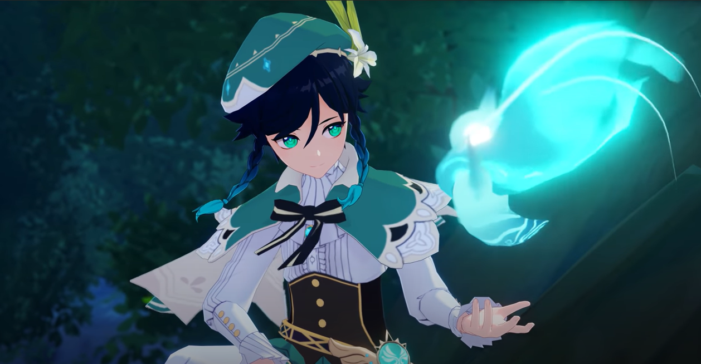
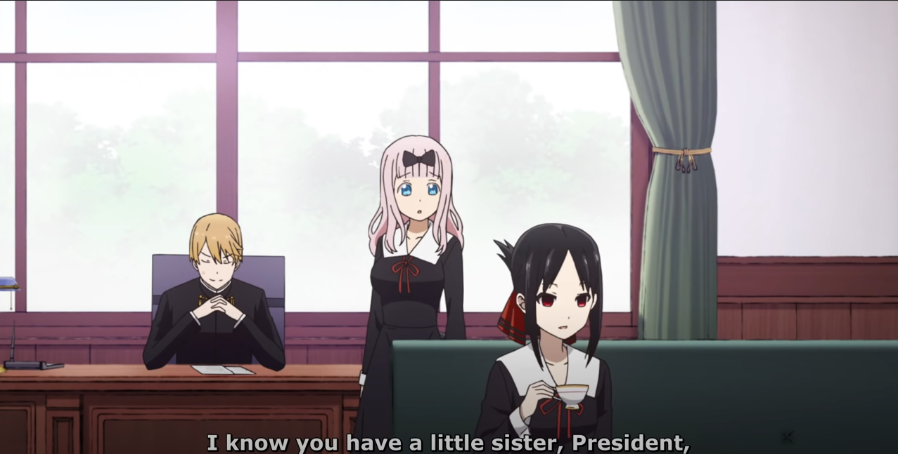

# Introduction

 

source of above video [[youtube]](https://www.youtube.com/watch?v=6LAGPO8Vuw4)

This repositroy developed based on [TinaFace](https://arxiv.org/abs/2011.13183) and [vedadet](https://github.com/Media-Smart/vedadet).

The model is trained by data from [anime-face-detector](https://github.com/qhgz2013/anime-face-detector)(Train 6000, validation 640) and [our custom pipeline](https://github.com/Mirai-Gadget-Lab/Anime-Face-Extract) for extract data from anime videos. We extract the datas from follwoing animes. 

name | season |
--- | --- | 
Mahouka Koukou no Rettousei | 1 |
Sword Art Online | 1, 2 |
My Youth Romantic Comedy Is Wrong, As I Expected | 1, 2|
Kaguya-sama: Love Is War | 1 |

Each anime season, our pipeline can extract about 3000 images. We split the datas 80% for training and 20% for validation.
For Detail about our pipeline, Please refer [here](https://github.com/Mirai-Gadget-Lab/Anime-Face-Extract)

## License

This project is released under the [Apache 2.0 license](LICENSE).

## Installation
### Requirements

- Linux
- Python 3.7+
- PyTorch 1.6.0 or higher
- CUDA 10.2 or higher

We have tested the following versions of OS and softwares:

- OS: Ubuntu 16.04.6 LTS
- CUDA: 10.2
- PyTorch 1.6.0
- Python 3.8.5

### Install vedadet

a. Create a conda virtual environment and activate it.

```shell
conda create -n vedadet python=3.8.5 -y
conda activate vedadet
```

b. Install PyTorch and torchvision following the [official instructions](https://pytorch.org/), *e.g.*,

```shell
conda install pytorch torchvision -c pytorch
```

c. Clone the vedadet repository.

```shell
git clone https://github.com/Media-Smart/vedadet.git
cd vedadet
vedadet_root=${PWD}
```

d. Install vedadet.

```shell
pip install -r requirements/build.txt
pip install -v -e .
```


e. Other libraries.

you need to install other libraries(pascal_voc_writer, pandas, tqdm, etc) in order to run training and test code.

## Data Preparation

### Dataset
a. Download danbooru dataset from [here](https://github.com/qhgz2013/anime-face-detector), and (optional) extract more data using [our pipeline](https://github.com/Mirai-Gadget-Lab/Anime-Face-Extract)


```
Data structure before processing
```plain
vedadet
├── vedadet
├── vedacore
├── tools
├── configs
├── data
│   ├── anime_face_detector
│   │   ├── train
│   │   │   ├── Annotations
│   │   ├── val
│   │   │   ├── Annotations
```
b. Run the following code to generate txt file of xmls.
```shell
cd ${vedadet_root}
bash process_xml.sh
```
c. Final data structure as follow
```plain
vedadet
├── vedadet
├── vedacore
├── tools
├── configs
├── data
│   ├── anime_face_detector
│   │   ├── train
│   │   │   ├── 0--danbooru
│   │   │   ├── 1--anime_1
│   │   │   ├── ......
│   │   │   ├── 22--anime_21
│   │   │   ├── Annotations
│   │   │   ├── train.txt
│   │   ├── val
│   │   │   ├── 0--danbooru
│   │   │   ├── 1--anime_1
│   │   │   ├── ......
│   │   │   ├── 22--anime_21
│   │   │   ├── Annotations
│   │   │   ├── val.txt
```
## Train

a. Config

Modify some configuration accordingly in the config file like `configs/trainval/anime_face_detection/animeface.py`

b. Multi-GPUs training
```shell
tools/dist_trainval.sh configs/anime_face_detection/animeface.py "0,1"
```

c. Single GPU training
```shell
CUDA_VISIBLE_DEVICES="0" python tools/trainval.py configs/trainval/anime_face_detection/animeface.py
```

## Test

a. Config

Modify some configuration accordingly in the config file like `configs/trainval/anime_face_detection/animeface.py`

b. Test
```shell
CUDA_VISIBLE_DEVICES="0" python tools/test.py configs/trainval/anime_face_detection/animeface.py weight_path
```

## Inference

a. Download weight.

Download weight here [Google Drive](https://drive.google.com/file/d/1_3rqrqSZllbyObuxGbLeLtf2z_gUMfjr/view?usp=sharing).

b. Config

Modify some configuration accordingly in the config file like `configs/infer/anime_face_detection/animeface.py`

### For image
c. Inference

```shell
CUDA_VISIBLE_DEVICES="0" python tools/infer.py configs/infer/anime_face_detection/animeface.py image_path
```
### For video(It is not stable yet. this code developed based [cheese-roll](https://github.com/cheese-roll/light-anime-face-detector))
```shell
CUDA_VISIBLE_DEVICES="0" python tools/infer_video.py configs/infer/anime_face_detection/animeface.py -i input_video_path -o out_video_path
```


## More inference result

original | Out | source |
--- | --- | --- |
 |  | [youtube](https://www.youtube.com/watch?v=nwMU-E1qmko&t=27s)|
 |  | [youtube](https://www.youtube.com/watch?v=uGrLP4189QQ&t=55s) |

## Contact

This repository is currently maintained by yw0nam. please contact for any issue.

## Credits
We can develop this code thanks to [vedadet](https://github.com/Media-Smart/vedadet).

